 

Soy **Senior IT Specialist** con más de una década de experiencia en entornos corporativos, industriales y de salud, manteniendo infraestructuras **estables, seguras y alineadas con las necesidades del negocio**.

Mi experiencia abarca la administración de servidores Windows y Linux, la virtualización con Proxmox, VMware y Hyper-V, la gestión de identidades y del ciclo de vida de los usuarios con Active Directory, las redes y la seguridad perimetral con Fortinet (VPN IPsec entre sedes) y las copias de seguridad con Veeam. He trabajado de la mano con equipos de soporte y proveedores externos, aplicando buenas prácticas de ITIL para cumplir los SLAs y asegurar la continuidad del servicio.

En la nube, trabajo con el ecosistema de Microsoft: Microsoft 365 (usuarios y licencias, SharePoint, correo y colaboración), la gestión de dispositivos con Intune, la protección de endpoints con CrowdStrike y Microsoft Azure, con foco en Entra ID y entornos híbridos. Mis conocimientos en bases de datos y desarrollo me dan una visión de extremo a extremo de los sistemas que administro.

En mi [blog](https://itserrano.com/blog/) escribo sobre problemas reales de infraestructura y cómo resolverlos.

 

 

 

<!-- BLOG-POST-LIST:START --><code>2026-10-01</code>&nbsp;&nbsp;<a href="https://itserrano.com/blog/gobernanza-de-ti-explicada-para-tecnicos-10-ejemplos-del-dia-a-dia/">Gobernanza de TI explicada para técnicos: 10 ejemplos del día a día</a> 
<code>2026-09-30</code>&nbsp;&nbsp;<a href="https://itserrano.com/blog/como-alojar-varios-sitios-wordpress-en-un-solo-servidor-con-nginx/">Cómo alojar varios sitios WordPress en un solo servidor con nginx</a> 
<code>2026-09-30</code>&nbsp;&nbsp;<a href="https://itserrano.com/blog/vpn-fortigate-como-saber-por-que-falla-la-autenticacion/">VPN FortiGate: cómo saber por qué falla la autenticación</a> 
<code>2026-09-28</code>&nbsp;&nbsp;<a href="https://itserrano.com/blog/procesos-en-estado-d-en-linux-por-que-kill-9-no-funciona/">Procesos en estado D en Linux: por qué kill -9 no funciona</a> 
<code>2026-09-25</code>&nbsp;&nbsp;<a href="https://itserrano.com/blog/tunel-ipsec-lento-en-fortigate-como-activar-la-aceleracion-npu/">Túnel IPsec lento en FortiGate: cómo activar la aceleración NPU</a> 
<!-- BLOG-POST-LIST:END -->

 

  &nbsp;
  &nbsp;
  &nbsp;
  

 

